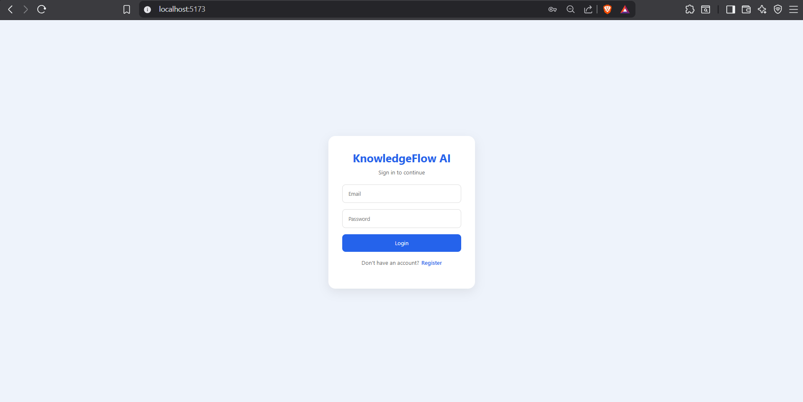
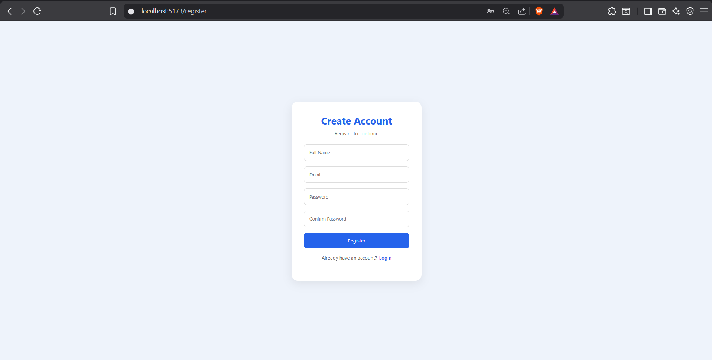
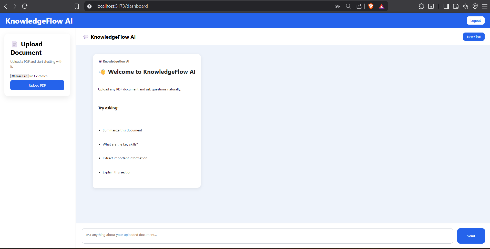
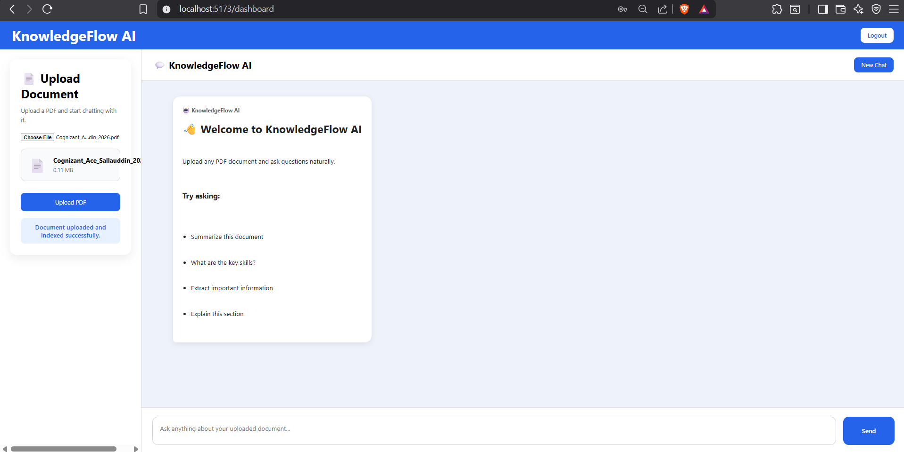
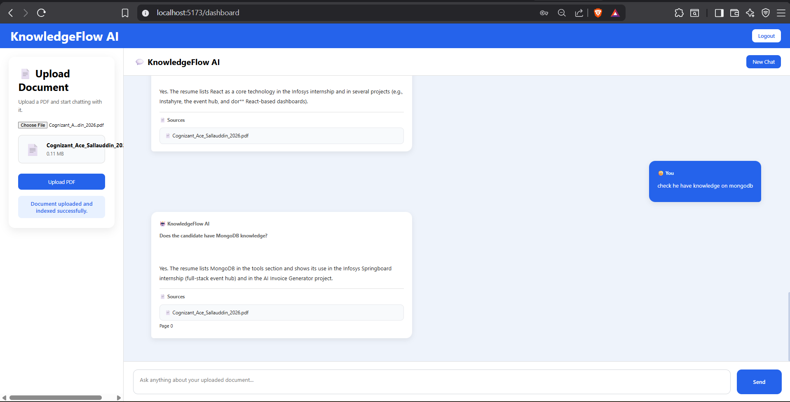
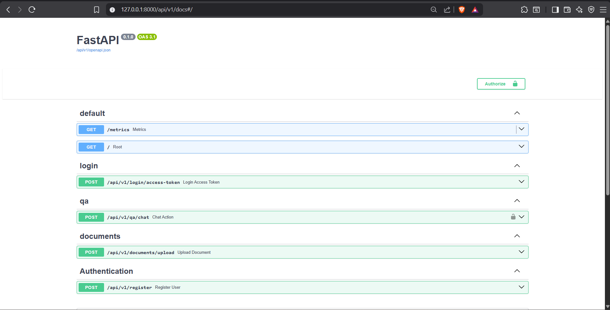

# 🧠 KnowledgeFlow AI

> **Enterprise Document Intelligence Platform using FastAPI, React, LangChain, PostgreSQL, and PGVector**

KnowledgeFlow AI is a full-stack Retrieval-Augmented Generation (RAG) application that enables users to securely upload PDF documents, ask natural language questions, generate AI-powered summaries, and receive context-aware answers with source citations.

---

# 🚀 Features

### Authentication
- User Registration
- Secure Login
- JWT Authentication
- Password Hashing (bcrypt)
- Protected Backend APIs
- Protected React Routes
- Logout

### Document Processing
- Upload PDF Documents
- Automatic Text Extraction
- Text Chunking
- Vector Embedding Generation
- PostgreSQL + PGVector Storage

### AI Capabilities
- Document Question Answering
- AI Document Summarization
- Semantic Search
- Context-Aware Retrieval
- Source Citations

### Frontend
- React Dashboard
- Markdown Rendering
- Responsive UI
- Loading Indicators

---

# 🏗 System Architecture

```text
                 ┌──────────────────────┐
                 │    React Frontend    │
                 │ Login • Upload • Chat│
                 └──────────┬───────────┘
                            │
                     HTTP + JWT
                            │
                            ▼
                 ┌──────────────────────┐
                 │   FastAPI Backend    │
                 │ Authentication & API │
                 └──────────┬───────────┘
                            │
          ┌─────────────────┼─────────────────┐
          │                 │                 │
          ▼                 ▼                 ▼
 PostgreSQL Users     PDF Upload API     Chat Endpoint
                            │
                            ▼
                    PDF Text Extraction
                            │
                            ▼
                      Document Chunking
                            │
                            ▼
     sentence-transformers/all-MiniLM-L6-v2
                            │
                            ▼
                     PostgreSQL + PGVector
                            │
                            ▼
                    LangChain Retriever
                            │
                            ▼
                    OpenRouter LLM
                            │
                            ▼
              AI Answer + Source Citations
```

---

# 🧠 AI Workflow

```
Upload PDF
      │
      ▼
Extract Text
      │
      ▼
Chunk Document
      │
      ▼
Generate Embeddings
      │
      ▼
Store in PGVector
      │
      ▼
Retrieve Relevant Chunks
      │
      ▼
OpenRouter LLM
      │
      ▼
Answer with Citations
```

---

# 💻 Tech Stack

| Layer | Technology |
|--------|------------|
| Frontend | React, React Router, Axios |
| Backend | FastAPI, SQLModel |
| AI | LangChain |
| Embeddings | sentence-transformers/all-MiniLM-L6-v2 |
| LLM | OpenRouter |
| Database | PostgreSQL |
| Vector Database | PGVector |
| Authentication | JWT, OAuth2, bcrypt |
| Containerization | Docker |

---

# 📂 Project Structure

```text
knowledgeflow-ai/
│
├── backend/
├── frontend/
├── docs/
│   └── screenshots/
├── README.md
├── LICENSE
├── .env.example
└── .gitignore
```

---

# ⚙ Installation

## Clone

```bash
git clone https://github.com/hakeemsallauddin/knowledgeflow-ai.git
```

## Backend

```bash
cd backend

poetry install

uvicorn app.api.main:app --reload
```

## Frontend

```bash
cd frontend

npm install

npm run dev
```

---

# 🔑 Environment Variables

Create a `.env` file in the backend directory.

```env
SECRET_KEY_ACCESS_API=
DB_HOST=
DB_PORT=
DB_NAME=
DB_USER=
DB_PASS=
OPENAI_API_KEY=
FIRST_SUPERUSER=
FIRST_SUPERUSER_PASSWORD=
```

---

# 📸 Application Screenshots

## Login



## Register



## Dashboard



## Upload



## Chat




## Swagger



---

# 📌 API Endpoints

| Method | Endpoint |
|---------|----------|
| POST | `/api/v1/register` |
| POST | `/login/access-token` |
| POST | `/api/v1/documents/upload` |
| POST | `/api/v1/qa/chat` |

---

# 🔮 Future Improvements

- Multiple document collections
- OCR support
- Conversation history
- User-specific document libraries
- Streaming AI responses
- Role-Based Access Control
- Admin Dashboard

---

# 👨‍💻 Author

**Sallauddin Hakeem**

GitHub: https://github.com/hakeemsallauddin